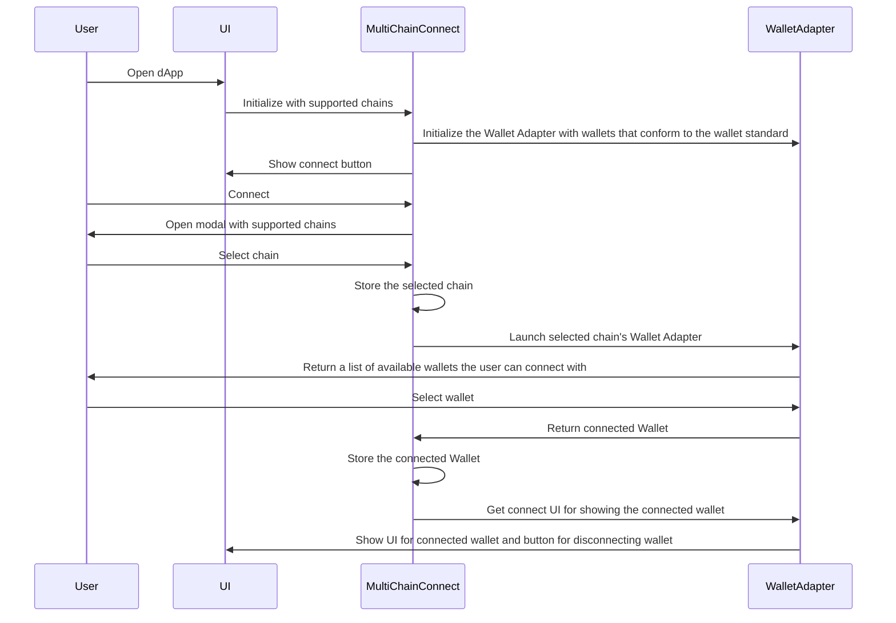

## Library Specification: Multi-Chain Wallet Support

### Overview
The library provides support for multiple chains by leveraging the [Wallet Standard](https://github.com/wallet-standard/wallet-standard). It enables the injection of wallets that conform to the wallet standard into Wallet Adapters. The Wallet Adapters serve as UI interfaces that allow users to select their preferred wallet for connecting to the dApp. The library currently supports the [Solana Wallet Adapter](https://github.com/solana-labs/wallet-adapter) and [Rainbowkit](https://www.rainbowkit.com), both of which implement the same interface. This design allows for easy switching between different Wallet Adapters.

### Core Functionality
1. Wallet Standard:
   - The library uses the wallet standard defined [here](https://github.com/wallet-standard/wallet-standard).
   - The standard interface includes common methods for connecting to a blockchain, signing transactions, and retrieving account information.

2. Wallet Adapters:
   - Wallet Adapters serve as UI interfaces for users to select their preferred wallet.
   - The Wallet Adapters should be capable of handling multiple wallets, each conforming to the wallet standard.
   - The library has implemented a mechanism for dynamically switching between different Wallet Adapters at runtime.
   - A common interface has also been developed to allow the use of different wallet adapters.
   - Currently, the library supports the [Solana Wallet Adapter](https://github.com/solana-labs/wallet-adapter) and [Rainbowkit](https://www.rainbowkit.com).

3. Solana Wallet Adapter:
   - Implements the Wallet Adapter interface specifically for the Solana blockchain.
   - Integrates with Solana wallets that conform to the wallet standard.
   - Provides a user-friendly interface for selecting and connecting to Solana wallets.
   - Supports common operations such as transaction signing and account information retrieval for Solana.

4. Rainbowkit Wallet Adapter:
   - Implements the Wallet Adapter specifically for EVM-supported wallets.
   - Integrates with the Rainbowkit wallet that conforms to the wallet standard.
   - Provides a user-friendly interface for selecting and connecting to EVM-supported wallets.
   - Supports common operations such as transaction signing and account information retrieval for Rainbowkit.

### Extensibility and Switching Wallet Adapters
1. Interface Consistency:
   - Ensures that all Wallet Adapters conform to the same interface defined by the wallet standard.
   - This allows for seamless switching between different Wallet Adapters without modifying the core library code.

2. Future Wallet Adapters:
   - The library is designed to be extensible, allowing for the addition of new Wallet Adapters in the future.
   - New Wallet Adapters should conform to the wallet standard and integrate with the library's core functionality.
   - Clear documentation and guidelines are provided for developers to create new Wallet Adapters.

### Installation

Install the component using `yarn install @civic/multichain-wallet-connect` or `npm i -S @civic/multichain-wallet-connect`.

### Architecture

The architecture can be viewed [here](https://mermaid.live/view#pako:eNqVVE1rwzAM_SvC5-0P5FAoHYzCxmCl9JKLGquNwbEzW17ZSv_77Ngt_abLyUh6T3rPcraisZJEJTx9BTINvShcO-xqA_Gbe3LPo9F8WsFHTwbkuO9LZhrj70GzmrSozMQaQw1XMDWKFWr1S7BR3IIPfW8dk4Qm1fmMvgBGsgVqTTyW2DO5EyJuCXIWSjpzb4aYj3lkaKxZWdcB26E-58AzGolO3m6btM1au0kEKQTLwGzNif4rOsvhDq9PKgbXOitR37PjdpsZ6TTTUHy71zUgW5ed8wPFvuPD_r9hME17hvZn95DZTpAH6Z_EwRlA0Moz2BXgNyqNS01HF0cQYjE0aA7-J59ObDkbrFiSOa4PcMWPMk1pEvUsjvD_9vRxmrPhX4kPQudTiBsLPi6fMusjzrK7N8zd72uBX8DiwpcdHvJS-VKSmuQa8SQ6ch0qGR_-NvWpRZTVUS2qeJS0wiilFrXZxVIMbGc_phEVu0BPIvQSef-fyMHdH73-g1Y).



### Example Usage

1. Importing the Library:

```javascript
import React from 'react';
import { MultichainWalletProvider, createChain } from '@civic/multichain-wallet-connect';

const ExampleComponent: React.FC = () => {
  return (
    <MultichainWalletProvider
      chains={[createChain.ethereum('mainnet')]}
    >
      <MultichainConnectButton />
    </MultichainWalletProvider>
  );
};

export default ExampleComponent;
```

### Custom button

1. Creating your own button with custom styling:

```javascript
/* eslint-disable import/no-extraneous-dependencies */
import React from "react";
import styled from "styled-components";
import { MultichainConnectedButton, useWallet, useModal } from "@civic/multichain-wallet-connect";

// Styled component named StyledButton
const StyledButton = styled.button`
  display: inline-block;
  border-radius: 20px;
  padding: 0.5rem 0;
  margin: 0.5rem 1rem;
  width: 11rem;
  border: 2px solid black;
  background: white;
  color: black;
`;

export function MultichainConnectButton(): JSX.Element | null {
  const { connected } = useWallet();
  const { openConnectModal } = useModal();

  return (
    <>
      {!connected && (
        <StyledButton type="button" onClick={openConnectModal}>
          Connect
        </StyledButton>
      )}
      <MultichainConnectedButton />
    </>
  );
}
```