## Multichain Connect React

### Overview
The Multichain Connect React library is a versatile TypeScript library that simplifies wallet integration for decentralized applications (dApps) by providing a unified interface for connecting to different wallets across multiple blockchains. It includes a React interface for seamless integration with React-based projects. The library allows developers to easily add new wallet adapters and supports customizable chain configurations. Once production ready, the library will consider porting over to the [following](https://github.com/wallet-standard/wallet-standard/tree/master/packages/react/core) Wallet Standard React interface.

### Core Functionality:
The library offers a multi-chain wallet adapter that serves as a bridge between dApps and various wallet providers. It provides a standardized API for wallet interactions, enabling users to connect their preferred wallet across different blockchains seamlessly.

#### React Interface:
Includes a pre-built React interface that simplifies the integration of wallet functionality into React applications. This interface offers intuitive components and hooks that developers can leverage to handle wallet interactions and user authentication with ease.

#### Chain Customization:
Developers can specify the chains they want to support within their application. Multichain Connect React allows for easy configuration of supported chains, such as EVM supported chains, Solana, etc. This flexibility enables dApps to cater to specific blockchain ecosystems while maintaining a consistent user experience.

#### Extensibility:
The library is designed with extensibility in mind. It provides a straightforward mechanism for adding additional wallet adapters, allowing developers to expand the range of supported wallets easily. By following the provided adapter interface and guidelines, new wallet integrations can be seamlessly incorporated into the existing framework. This also gives the user flexibility in which wallet adapters they choose to use.

## Installation

To use the MultiChain Wallet Connect React components, follow these steps:

1. Install the package using npm:

   ```shell
   npm install @civic/multichain-connect-react-core @civic/multichain-connect-react-solana-wallet-adapter @civic/multichain-connect-react-rainbowkit-wallet-adapter wagmi/providers/public @solana/web3.js
   ```

   or using Yarn:

   ```shell
   yarn add @civic/multichain-connect-react-core @civic/multichain-connect-react-solana-wallet-adapter @civic/multichain-connect-react-rainbowkit-wallet-adapter wagmi/providers/public @solana/web3.js
   ```

2. Import the necessary components and dependencies into your code:

   ```javascript
   import { MultichainWalletProvider, MultichainConnectButton } from '@civic/multichain-connect-react-core';
   import { Chain as SolanaChain, SolanaWalletAdapterConfig } from '@civic/multichain-connect-react-solana-wallet-adapter';
   import { Chain as EthereumChain, RainbowkitConfig } from '@civic/multichain-connect-react-rainbowkit-wallet-adapter';
   import { publicProvider } from 'wagmi/providers/public';
   import { Connection } from '@solana/web3.js';
   import { mainnet, goerli, polygon, arbitrum, arbitrumGoerli, polygonMumbai } from 'wagmi/chains';
   ```

   Note: Make sure you have the required dependencies installed, including `@solana/web3.js`.

## Usage

To use the MultiChain Wallet Connect React components, follow these steps:

1. Wrap your application or relevant components with the `MultichainWalletProvider` component:

   ```javascript
   <MultichainWalletProvider>
     {/* Your application components */}
   </MultichainWalletProvider>
   ```

2. Configure the Solana wallet adapter by using the `SolanaWalletAdapterConfig` component within the `MultichainWalletProvider`:

   ```javascript
   const solanaChains = [
    { name: 'Solana', rpcEndpoint: clusterEndpoint('mainnet-beta') },
    { name: 'Solana Devnet', rpcEndpoint: clusterEndpoint('devnet') }];

   <MultichainWalletProvider>
     <SolanaWalletAdapterConfig chains={solanaChains}>
       {/* Your application components */}
     </SolanaWalletAdapterConfig>
   </MultichainWalletProvider>
   ```

3. Configure the Rainbowkit wallet adapter by using the `RainbowkitConfig` component within the `MultichainWalletProvider`:

   ```javascript
   const evmChains = [
     polygon,
     polygonMumbai,
     mainnet,
     goerli,
   ];
   const initialChain = { ...polygonMumbai, type: SupportedChains.Ethereum };

   <MultichainWalletProvider initialChain={initialChain}>
     <RainbowkitConfig
       chains={evmChains}
       theme={myCustomTheme}
       providers={[publicProvider()]}
       options={{
         // Rainbowkit relies on WalletConnect which now needs to obtain a projectId from WalletConnect Cloud.
         walletConnectProjectId: "*YOUR WALLET CONNECT PROJECT ID*",
       }}
     >
       {/* Your application components */}
     </RainbowkitConfig>
   </MultichainWalletProvider>;
   ```

   Replace `initialChain`, `myCustomTheme`, and `publicProvider()` with the appropriate values and configurations for your project.

4. Use the `MultichainConnectButton` component to display the wallet connection button in your application:

   ```javascript
   <MultichainWalletProvider>
     <RainbowkitConfig>
       <SolanaWalletAdapterConfig>
         <MultichainConnectButton/>
       </SolanaWalletAdapterConfig>
     </RainbowkitConfig>
   </MultichainWalletProvider>
   ```

Customize the placement and appearance of the button as needed in your application's layout.

That's it! You can now integrate MultiChain Wallet Connect React components into your application to enable wallet connectivity and interactions with Solana and Ethereum-based chains.

### Architecture

The architecture can be viewed [here](https://mermaid.live/view#pako:eNqVVE1rwzAM_SvC5-0P5FAoHYzCxmCl9JKLGquNwbEzW17ZSv_77Ngt_abLyUh6T3rPcraisZJEJTx9BTINvShcO-xqA_Gbe3LPo9F8WsFHTwbkuO9LZhrj70GzmrSozMQaQw1XMDWKFWr1S7BR3IIPfW8dk4Qm1fmMvgBGsgVqTTyW2DO5EyJuCXIWSjpzb4aYj3lkaKxZWdcB26E-58AzGolO3m6btM1au0kEKQTLwGzNif4rOsvhDq9PKgbXOitR37PjdpsZ6TTTUHy71zUgW5ed8wPFvuPD_r9hME17hvZn95DZTpAH6Z_EwRlA0Moz2BXgNyqNS01HF0cQYjE0aA7-J59ObDkbrFiSOa4PcMWPMk1pEvUsjvD_9vRxmrPhX4kPQudTiBsLPi6fMusjzrK7N8zd72uBX8DiwpcdHvJS-VKSmuQa8SQ6ch0qGR_-NvWpRZTVUS2qeJS0wiilFrXZxVIMbGc_phEVu0BPIvQSef-fyMHdH73-g1Y).

```mermaid
sequenceDiagram
    User->>UI: Open dApp
    UI->>MultiChainConnect: Initialize with supported chains
    MultiChainConnect->>WalletAdapter: Initialize the Wallet Adapter with wallets that conform to the wallet standard
    MultiChainConnect->>UI: Show connect button
    User->>MultiChainConnect: Connect
    MultiChainConnect->>User: Open modal with supported chains
    User->>MultiChainConnect: Select chain
    MultiChainConnect->>MultiChainConnect: Store the selected chain
    MultiChainConnect->>WalletAdapter: Launch selected chain's Wallet Adapter
    WalletAdapter->>User: Return a list of available wallets the user can connect with
    User->>WalletAdapter: Select wallet
    WalletAdapter->>MultiChainConnect: Return connected Wallet
    MultiChainConnect->>MultiChainConnect: Store the connected Wallet
    MultiChainConnect->>WalletAdapter: Get connect UI for showing the connected wallet 
    WalletAdapter->>UI: Show UI for connected wallet and button for disconnecting wallet
```



### Custom button

1. Creating your own button with custom styling:

```javascript
import React from "react";
import styled from "styled-components";
import { MultichainConnectedButton, useWallet, useModal } from "@civic/multichain-connect-react";

// Styled component named StyledButton
const StyledButton = styled.button`
  display: inline-block;
  border-radius: 20px;
  padding: 0.5rem 0;
  margin: 0.5rem 1rem;
  width: 11rem;
  border: 2px solid black;
  background: white;
  color: black;
`;

export function MultichainConnectButton(): JSX.Element | null {
  const { connected } = useWallet();
  const { openConnectModal } = useModal();

  return (
    <>
      {!connected && (
        <StyledButton type="button" onClick={openConnectModal}>
          Connect
        </StyledButton>
      )}
      <MultichainConnectedButton />
    </>
  );
}
```
